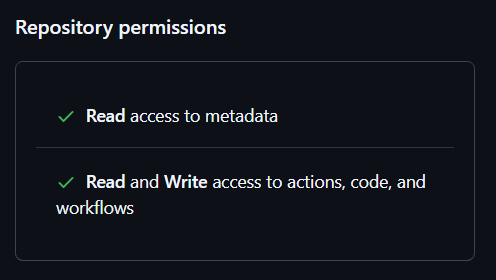

## Installing pipeline-executor to your repo

### 1. Creating new repo

First of all, it's recommended to create a new GitHub repository for using pipeline-executor.
Repo itself can be a personal one or a part of an organization, private or public - there's no restriction.
You might even need few of these repos, to keep things logically grouped, separated and manageable.

You will need admin-access to this repository during configuration, as you will need to add new workflows and issue security tokens.

### 2. Adding workflows

As a starting point, copy contents of the provided [tenant_sample_repo](../tenant_sample_repo) directory into your repository.

It has 2 mandatory workflows (`EXECUTE_ATLAS_PIPELINE.yml` and `GENERATED_WORKFLOW.yml`) and an optional housekeeping one (`CLEANUP.yml`) (and also a `pipelines` folder with sample pipelines, which you might not need)

You will be using `EXECUTE_ATLAS_PIPELINE.yml` as an entrypoint to start the process of generating and executing Atlas Pipelines (either via UI or via GitHub API)

You might want to set your desired version of `pipeline-executor` in refs of the used composite actions in these workflows, e.g.:

Change
```
uses: LightlessOne/dynamic-workflow-test/actions/execute_atlas_pipeline@main
uses: LightlessOne/dynamic-workflow-test/actions/cleanup_old_runs@main
```
to
```
uses: LightlessOne/dynamic-workflow-test/actions/execute_atlas_pipeline@v1.0.0
uses: LightlessOne/dynamic-workflow-test/actions/cleanup_old_runs@v1.0.0
```

After adding these files and, optionally, setting the desired version, you need to push your changes into your repo's default branch (e.g. `main`)

### 3. Generating Access token

Actions, used in pipeline-executor require ability to create new branches in your repo, trigger and remove workflows, and change workflow files.

One way to provide these capabilities is issuing `Fine-grained personal access token` on your personal or technical account, with mentioned permissions.



And you will need to save this token as a secret in your repository (default expected name for this token in provided workflows is `WORKFLOW_TOKEN`, but you can customize it)

### 4. Testing your configuration with provided pipelines

To test whether your configuration is correct, you might want to use one of the provided sample workflows, e.g. `pipelines/e2e-fresh.yaml`.

To do so, navigate to `Actions` tab in your repository, select `Execute Atlas Pipeline` action, and press `Run Workflow` button.

Provide `PIPELINE_DATA` as `pipelines/e2e-fresh.yaml` to use local pipeline file from your repo, and press the green `Run Workflow` button below the parameters.
